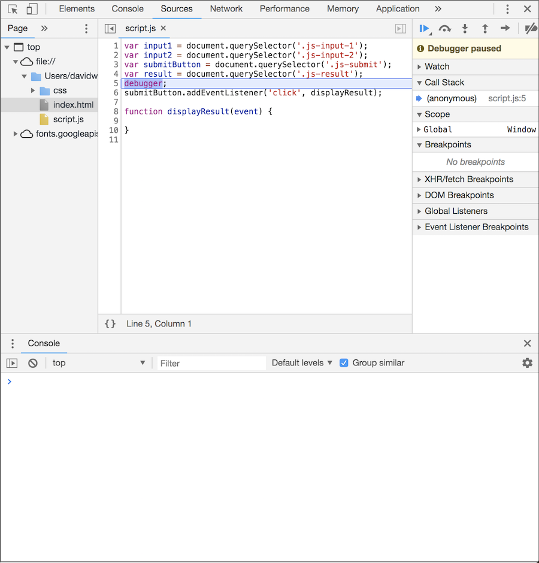

# `debugger;`

### Learning Goals

- Understand how to use debugger statements in chrome

### Vocabulary

- debugger

### Getting Started

Debugging JavaScript is hard. Thus far, you have likely been sprinkling `console.log` statements all 
throughout your code in order to check data types, the values of variables, to confirm a conditional is evaluating as expected, etc.
There is a more efficient way to do all of these things. That way is to use a `debugger` statement.

**debugger** will set breakpoints in our JavaScript. A breakpoint lets us pause our code in the middle of its execution, and examine all values at that moment in time. 

### Let's see it in action 

I've cloned down this repo, opened the `index.html` file in my browser, and opened this entire repo in my text editor.
Inside of the `script.js` file, I'm going to insert a `debugger` statement after the global variable declarations and before the event listener.
It should look like this: 

```javascript
// variables here

debugger;

// event listener here
```

Next I'll save the file, go to the browser, and refresh the page.

#### What's happening?

In `console.log()` statements you need to explicitly specify each value that you want to inspect. 

With debugger breakpoints, DevTools shows you the values of all variables at that moment in time when we hover over files in the sources tab. 
Sometimes there are variables affecting your code that you're not even aware of.

We can also type variable names into our dev console drawer to see what those variables evaluate to at that moment in time.

In order to exit out of our `debugger` session we can click the  button to resume script execution.

### Your turn

#### Setup

1. Clone down this repo `git clone https://github.com/turingschool-examples/debugger-intro`

2. Change into this repo `cd debugger-intro`

3. Open the index.html file in the browser `open index.html`

4. Open your dev tools - **always** `cmd + option + i`

5. Open the entire repo in your text editor `sublime .`

Now that we're all setup, we can insert some debugger statements!

1. What happens if we insert a `debugger;` into the displayResult function of the `script.js` file?
2. Go to the browser and refresh the page.
3. What properties and methods are there on the `event` object being passed in?

**Pro Tip:** Make sure that your console drawer is open even when your on the sources tab:



### Your turn

We do have an actual bug in this code.

If we have the number 1 in our first input and the number 2 in our second input, we would expect the result on the page to be 3 when we hit the submit button.
However, we can see that's not the case - the result that we're actually seeing is 12.

Use `debugger` to fix the bug so that the correct result shows up on the page.

### Turn and talk

With a partner, come up with an analogy or analogies for both `console.log` and `debugger`

### Your turn

Leverage `debugger` to add functionality to clear the input fields on submit.

#### Another your turn

Leverage `debugger` to add functionality (with JavaScript, not HTML) to ensure that only numbers can be submitted from each input field. An error should display if either input field is not a number on submit.

### Dig Deeper

* [Chrome Dev Tools Debugging Tutorial](https://developers.google.com/web/tools/chrome-devtools/javascript/)

